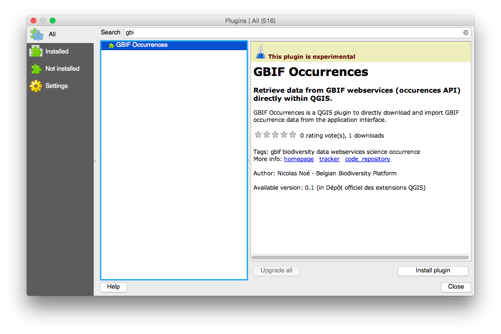

What is it?
===========

A [QGIS](http://www.qgis.org/) plugin to directly download and import [GBIF](http://www.gbif.org) occurrence data from the application interface.

Tutorial
========

Installation
------------

1. Launch QGIS
2. In the main menu, go to `Plugins` -> `Manage and install plugins...`
3. Go to `Settings`and make sure `Show also experimental plugins` is checked
4. Go back to the `All` tab and search for `GBIF occurrences`
5. Select the plugin and click on `Install plugin`

Use
---

1. Open the extension window from the main menu: Vector -> GBIF Occurrences -> Load GBIF Occurrences (alternatively, use the icon in the toolbar).

2. Fill in the details about yout search (for example: *betta splendens* occurring in Thailand) and click "Load occurrences".

3. Done! You'll notice a new QGIS layer for your occurrences. All details known by GBIF are also available as attributes.

Limitations
-----------

- More filters should be implemented.
- Due to limitations of the GBIF API, searches are limited to 200,000 records.

Status
======

First release ok! Feel free to report any bug or feature requests (or even better, contribute to improve it!)

Running tests:
==============

$ make test

(Currently it is difficult to run tests on Mac OS X since Kyngchaos QGIS packages embed PyQt without the QtTest module.)

How-to release:
===============

- Bump version number and update changelog in metadata.txt.
- Submit the plugin to the QGIS plugins repository **making sure that there's no dash in the directory name** (it should be a proper Python package).
- create a git tag and push it to github:

    $ git tag v0.1-in-plugin-repo
    $ git push origin --tags