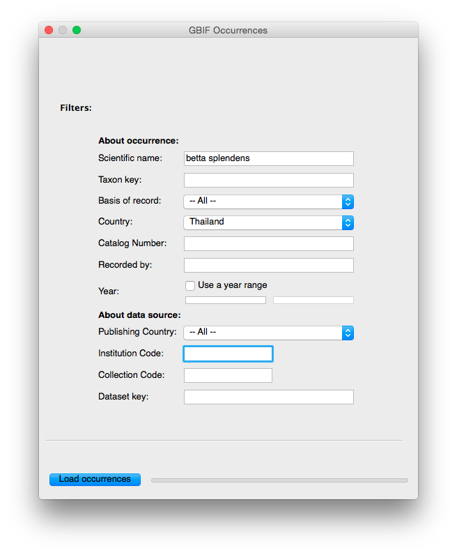
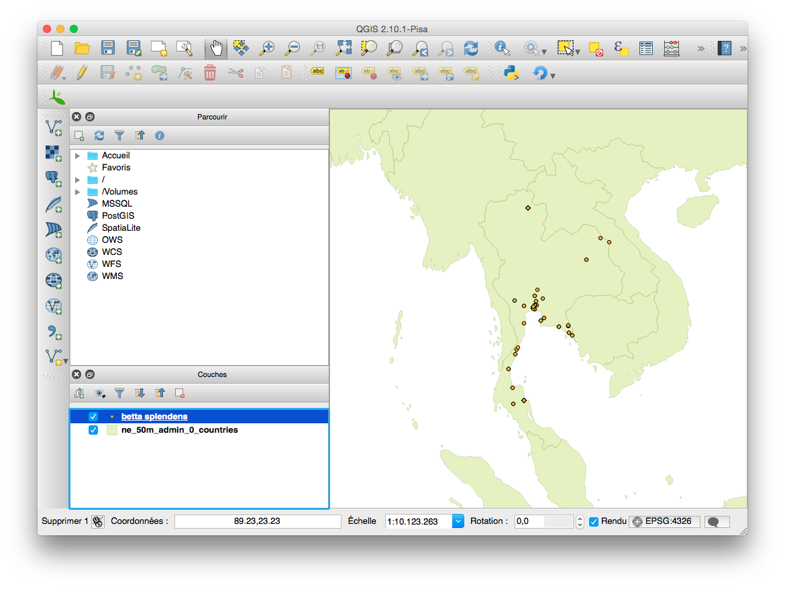
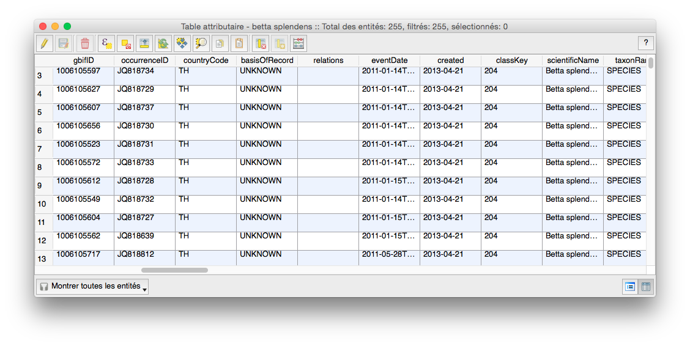

What is it?
===========

A [QGIS](http://www.qgis.org/) plugin to directly download import [GBIF](http://www.gbif.org) occurrence data from the application interface.

Tutorial
========

Installation
------------

At this stage, install plugin manually within QGIS data directory then enable it in the plugin manager. 

**It will be available soon directly from the [QGIS Python Plugins Repository](https://plugins.qgis.org/plugins/), for easier installation.**

Use
---

1. Open the extension window from the main menu: Vector -> GBIF Occurrences -> Load GBIF Occurrences (alternatively, use the icon in the toolbar).

2. Fill in the details about yout search (for example: *betta splendens* occurring in Thailand) and click "Load occurrences".

3. Done! You'll notice a new QGIS layer for your occurrences. All details known by GBIF are also available as attributes.

Limitations
-----------

- More filters should be implemented.
- Due to limitations of the GBIF API, searches are limited to 200,000 records.

Status
======

First release ok! Feel free to report any bug or feature requests (or even better, contribute to improve it!)

Running tests:
--------------

$ make test

(Currently it is difficult to run tests on Mac OS X since Kyngchaos QGIS packages embed PyQt without the QtTest module.)