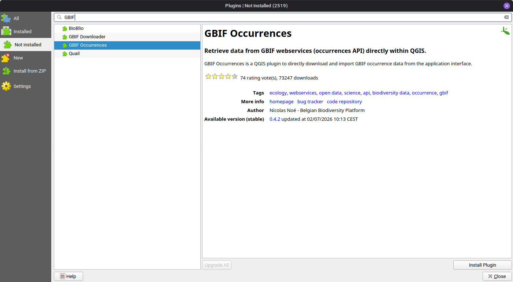
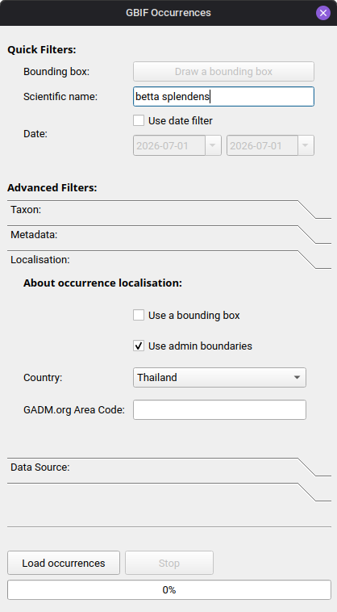
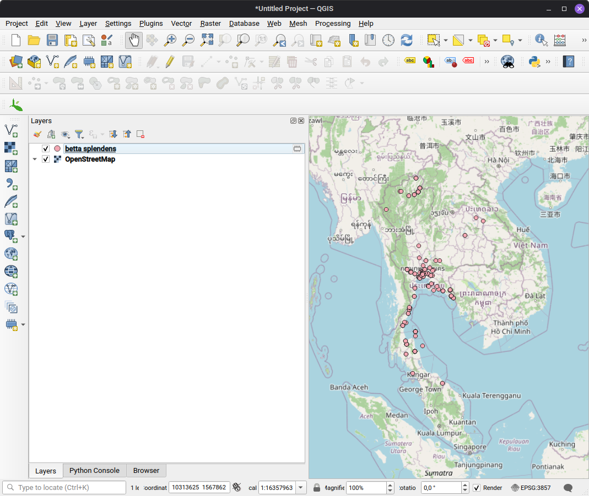
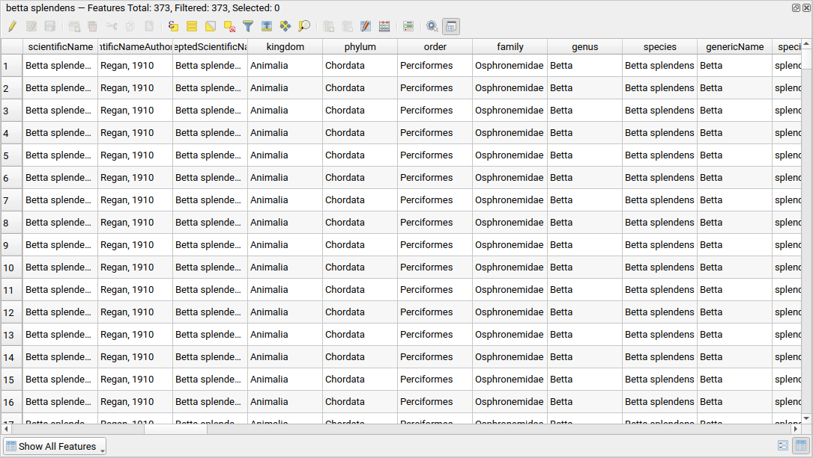

What is it?
===========

A [QGIS](http://www.qgis.org/) plugin to directly download and import [GBIF](http://www.gbif.org) occurrence data from the application interface.

Tutorial
========

Installation
------------

1. Launch QGIS
2. In the main menu, go to `Plugins` -> `Manage and install plugins...`
3. In the `All` tab, search for `GBIF occurrences`
4. Select the plugin and click on `Install plugin`

Use
---

1. Open the extension window from the main menu: Vector -> GBIF Occurrences -> Load GBIF Occurrences (alternatively, use the  icon in the toolbar).

2. Fill in the details about yout search (for example: *betta splendens* occurring in Thailand) and click "Load occurrences".

3. Done! You'll notice a new QGIS layer for your occurrences. All details known by GBIF are also available as attributes.

Limitations
-----------

- More filters should be implemented.
- The plugin is not yet compliant with GBIF and QGIS recommendation (data citation, limit usage of external libs like requests)
- No translation
- Documentation limited
- Due to limitations of the GBIF API, searches are limited to 200,000 records.

Changelog
=========
Since July 2024 there has not been any development on this plugin. Yet it was still one of the most used QGIS plugin for biodiversity data.
Another developer, Jules Grillot, joined the development 2 years after the last commit to update the plugin for newer version and add some features :

- Add more filters (extent, date not only based on year but on day and month)
- Improve UI (quick and advanced search, use appropriate QWidget, add tooltip)

Status
======

First release ok! Feel free to report any bug or feature requests (or even better, contribute to improve it!)

We are now working on a new release compatible with QGIS4.
A roadmap is coming soon, to guide the future development and the potential contributors.

Running tests:
==============

The `test/` directory holds legacy `unittest` suites that mock the GBIF API with
`httmock`. They must run under QGIS's own bundled Python, which provides the
`qgis`, `PyQt` and `QtTest` modules (there is no `make test` target).

Running the tests on macOS is currently difficult, because the Kyngchaos QGIS
packages embed PyQt without the `QtTest` module.

How-to release:
===============

Releases are automated with [qgis-plugin-ci](https://github.com/opengisch/qgis-plugin-ci)
and GitHub Actions. In short:

- Bump `version=` and update the `changelog=` block in
  `qgisgbifapi/metadata.txt`, then merge to `master`.
- Push a **bare** version tag (no `v` prefix), matching the version you set:

    $ git tag 0.4.1
    $ git push origin 0.4.1

Pushing the tag triggers the workflow, which builds the zip, creates the GitHub
release, and publishes to plugins.qgis.org. See [RELEASING.md](RELEASING.md) for
the full process.
